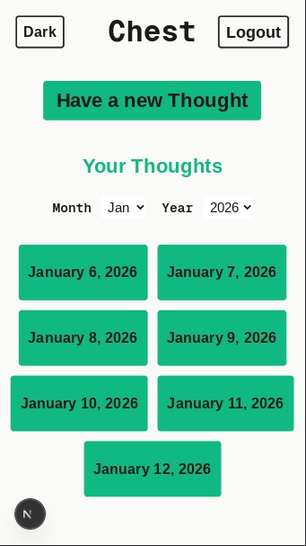
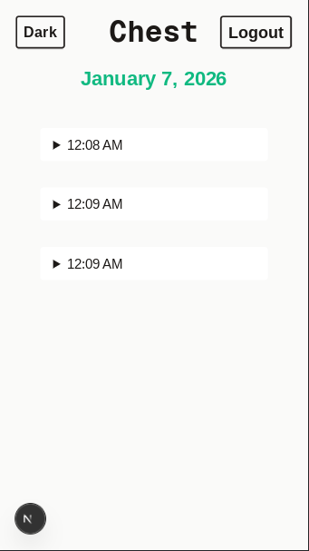
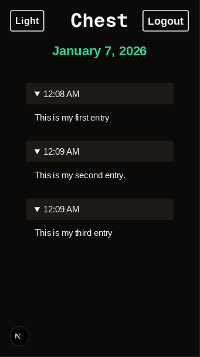
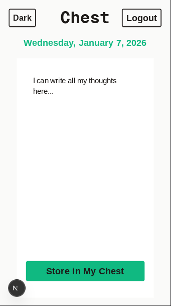
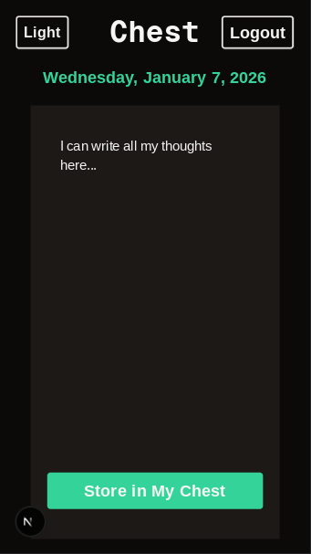

# 🪙 Chest

**Chest** is a private digital sanctuary for your daily thoughts. It provides a structured way to log entries, automatically organizing your life by date and ensuring your data is secure behind personal authentication.

You can view the live version of Chest at:  
[**https://my-chest.vercel.app/**](https://my-chest.vercel.app/)

---

## 📸 Project Preview

| Feature | Light Mode | Dark Mode |
| :--- | :--- | :--- |
| **Home** |  |  |
| **Daily Entry List** |  |  |
| **New Entry** |  |  |

---

## ✨ Core Features

- **Personal Authentication:** Secure account creation and login to keep your "Chest" private.
- **Date-Centric Organization:** The home page automatically groups your entries by date and has filters for month and year for a chronological view of your journey.
- **Dedicated Daily Views:** Separate, dynamic pages for every date that list all entries recorded during that 24-hour window.
- **Instant Entry Storage:** High-performance data persistence using Next.js Server Actions and Drizzle ORM.
- **Adaptive UI:** Full support for Light and Dark modes via `next-themes`.

## 🛠️ Tech Stack

- **Framework:** [Next.js 16 (App Router)](https://nextjs.org/)
- **Database:** [Neon PostgreSQL](https://neon.tech/)
- **ORM:** [Drizzle ORM](https://orm.drizzle.team/)
- **Styling:** [Tailwind CSS](https://tailwindcss.com/)
- **Theming:** [next-themes](https://github.com/pacocoursey/next-themes)

---

## 🚀 Getting Started

### 1. Clone & Install
```bash
git clone [https://github.com/shabih-abbas/chest.git](https://github.com/shabih-abbas/chest.git)
cd chest
npm install
```

### 2. Environment Setup
```
DATABASE_URL=YOUR_NEON_DB_CONNECTION_STRING
JWT_SECRET=YOUR_JWT_SECRET
```

### 3. Database Sync
```bash
npm run db:push
```

### 4. Development
```bash
npm run dev
```